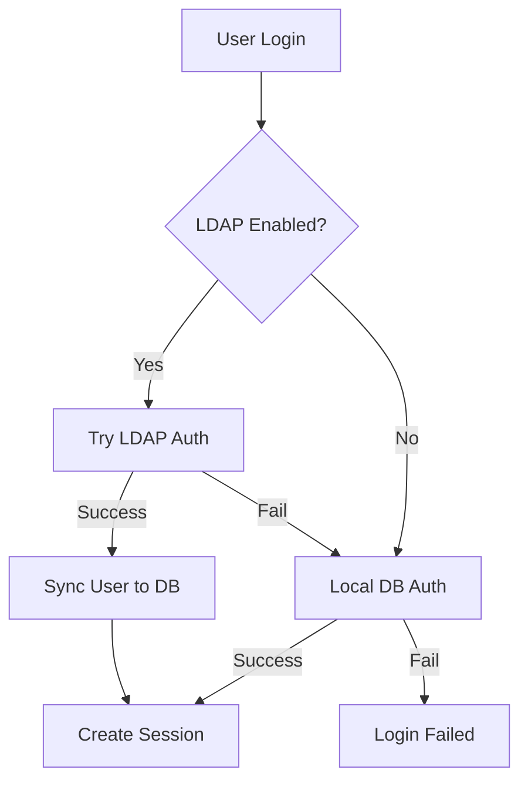

# LDAP Setup Guide

## Overview
This guide explains how to configure LDAP/Active Directory integration for Amnezia VPN Panel.

## Supported LDAP Servers
- OpenLDAP
- Active Directory (AD)
- FreeIPA
- Any RFC 4511 compliant LDAP server

## Configuration

### 1. Enable LDAP in Admin Panel
1. Navigate to Settings → LDAP
2. Enable "LDAP Authentication"
3. Fill in connection details

### 2. Connection Settings

#### For Active Directory:
```
Host: ad.example.com
Port: 389 (LDAP) or 636 (LDAPS)
Use TLS: ☑ (recommended for production)
Base DN: DC=example,DC=com
Bind DN: CN=svc_vpn,CN=Users,DC=example,DC=com
Bind Password: YourServiceAccountPassword
User Search Filter: (sAMAccountName=%s)
Group Search Filter: (member=%s)
```

#### For OpenLDAP:
```
Host: ldap.example.com
Port: 389
Use TLS: ☑
Base DN: ou=people,dc=example,dc=com
Bind DN: cn=admin,dc=example,dc=com
Bind Password: YourAdminPassword
User Search Filter: (uid=%s)
Group Search Filter: (memberUid=%s)
```

### 3. Group Mappings

Map LDAP groups to panel roles:

| LDAP Group   | Panel Role | Permissions |
|-------------|-----------|-------------|
| vpn-admins  | admin     | Full access |
| vpn-managers| manager   | Manage servers & clients |
| vpn-users   | viewer    | View own clients only |

#### How to configure groups:

**Active Directory:**
```powershell
# Create security groups
New-ADGroup -Name "vpn-admins" -GroupScope Global -GroupCategory Security
New-ADGroup -Name "vpn-managers" -GroupScope Global -GroupCategory Security  
New-ADGroup -Name "vpn-users" -GroupScope Global -GroupCategory Security

# Add users to groups
Add-ADGroupMember -Identity "vpn-admins" -Members "john.doe"
```

**OpenLDAP:**
```ldif
dn: cn=vpn-admins,ou=groups,dc=example,dc=com
objectClass: groupOfNames
cn: vpn-admins
member: uid=john.doe,ou=people,dc=example,dc=com
```

### 4. Test Connection
1. Click "Test Connection" button in LDAP settings
2. Verify successful connection
3. Save configuration

### 5. Synchronization
- **Automatic**: Users sync every 30 minutes (configurable)
- **Manual**: Run `docker-compose exec web php bin/sync_ldap_users.php`

## Authentication Flow



## Security Best Practices

1. **Use TLS/SSL**
   - Always enable TLS for production
   - Use LDAPS (port 636) for encrypted connections

2. **Service Account**
   - Create dedicated read-only service account
   - Grant minimum required permissions
   - Use strong password

3. **Group-Based Access**
   - Use security groups for access control
   - Regular audit of group memberships
   - Remove inactive users from groups

4. **Firewall Rules**
   - Allow LDAP traffic only from VPN panel server
   - Block direct LDAP access from internet

## Troubleshooting

### Connection Issues
```bash
# Check LDAP connectivity
docker-compose exec web php -r "
require 'vendor/autoload.php';
require 'inc/Config.php';
require 'inc/DB.php';
require 'inc/LdapSync.php';
\$ldap = new LdapSync();
var_dump(\$ldap->testConnection());
"
```

### View Sync Logs
```bash
docker-compose exec web tail -f /var/log/ldap_sync.log
```

### Common Errors

**Error:** `Failed to bind`
- **Solution:** Check Bind DN and password

**Error:** `Can't contact LDAP server`
- **Solution:** Verify host, port, and firewall rules

**Error:** `Invalid credentials`
- **Solution:** User not found or wrong password

## Examples

### Migrate from Local to LDAP Auth
1. Enable LDAP
2. Run initial sync: `docker-compose exec web php bin/sync_ldap_users.php`
3. Existing users can still login with local passwords
4. LDAP users auto-created on first login

### Disable User
Remove user from LDAP groups → Next sync will disable account

### Change User Role
Move user to different LDAP group → Role updates on next login

## Support

For issues, check:
- `/var/log/ldap_sync.log` - Synchronization logs
- PHP error logs in Docker container
- LDAP server logs

## Advanced Configuration

### Custom User Attributes
Edit `inc/LdapSync.php` to map additional LDAP attributes:
```php
[
    'displayName' => $entries[0]['displayname'][0],
    'phone' => $entries[0]['telephonenumber'][0],
    'department' => $entries[0]['department'][0]
]
```

### Multiple LDAP Servers
Currently supports single LDAP server. For multiple servers, create separate instances or use LDAP proxy.

### SSO Integration
LDAP auth provides foundation for SSO. Consider SAML/OAuth for full SSO implementation.
